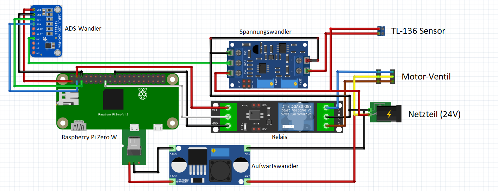
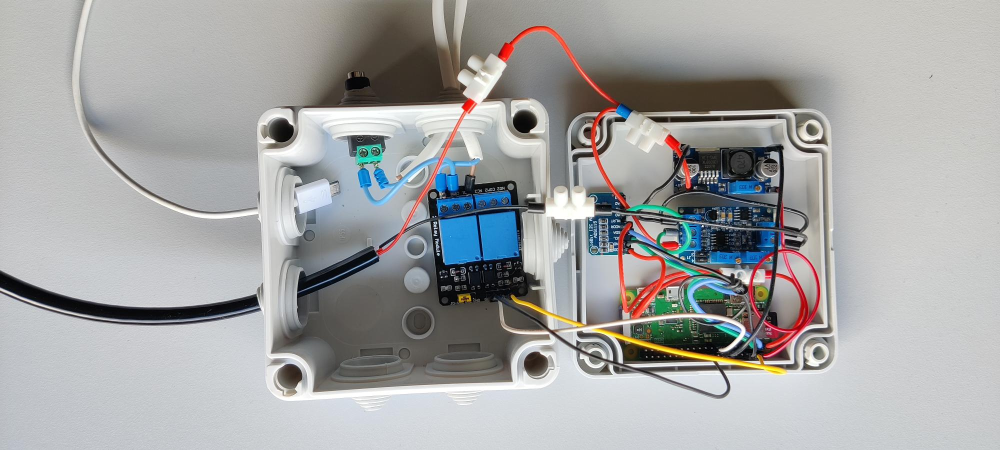
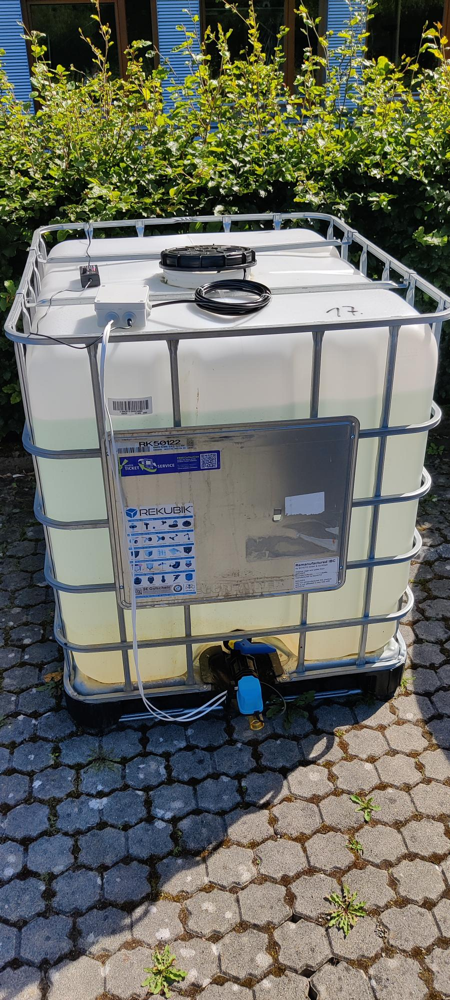

# OOWV Smart Watertank Controller

Willkommen in der Dokumentation für das OOWV Smart Watertank Controller Repository. Hier erfährst du alles, was du über den Controller zur Steuerung des intelligenten Wassertanks wissen musst.

## Hardware
#### Controller

Folgende Hardware-Komponenten werden für den Controller benötigt:

- Raspberry Pi Zero W: Ein leistungsstarker Einplatinencomputer.
https://www.amazon.de/dp/B06XFZC3BX

- SanDisk Ultra Android microSDHC 32GB: Zum Speichern des Betriebssystems und der Daten.
https://www.amazon.de/dp/B08GY9NYRM

- AZDelivery 2-Relais Modul 5V: Für die Schaltung von Geräten.
https://www.amazon.de/dp/B078Q326KT

- Aufwärtswandler XL6009(3V-32V zu 5V-35V): Zur Spannungsanpassung.
https://www.amazon.de/dp/B00HV59922

- Füllstandssensor (TL-136): Misst den Wasserstand im Tank.
https://www.amazon.de/dp/B08YWQJM1T

- Analog-zu-Digital-Wandlermodul ADS1115: Konvertiert analoge Signale in digitale Werte.
https://www.amazon.de/dp/B09135KBLT

- Strom zu Spannungsmodul (4-20Ma Bis 0-3.3V 5V 10V): Wandelt Strom in Spannungsbereich um.
https://www.amazon.de/dp/B07TWLG37N

- 24V Netzteil

- Micro-USB Kabel

- Verteilerdose zum Verstauen der Hardware-Komponenten

#### Wassertank

- 1000L IBC Container
https://www.rekubik.de/ibc-container/neue-ibc/1000l-ibc-container-rebottled-food-auf-stahlpalette-neuwertig?number=RK50122

- IBC Adapter S60x6 - 2-fach 1" Kugelhahn mit 3/4" Tülle
https://www.rekubik.de/ibc-zubehoer/adapter/s60x6-grobgewinde/ibc-adapter-s60x6-2-fach-1-kugelhahn-mit-3/4-tuelle-geka-kompatibel

- Motorkugelhahnventil
https://www.amazon.de/dp/B07V2VX76C

## Installation

#### Installation des Raspberry Pi Zero

Um das Raspberry Pi OS auf dem Raspberry zu installieren empfiehlt sich der [Raspberry Pi Imager](https://www.raspberrypi.com/software/).

Als Betriebssystem sollte das Raspberry Pi OS (32-bit) ausgewählt werden und als Speichermedium die jeweilige mit dem PC verbundene SD-Karte.
Unter den Erweiterten Optionen müssen anschließend ein Hostname gesetzt werden sowie die SSH Option aktiviert werden und dafür Benutzername und Passwort für die Anmeldung des SSH Clients erstellt und notiert werden.
Abschließend müssen zur Verbindung mit einem Netzwerk noch die benötigten Daten eingetragen werden.


Anschließend kann die Installation gestartet werden.

#### Zugriff auf den Raspberry Pi mittels SSH Terminal
Nach Abschluss der Installation des OS auf der SD Karte, kann diese anschließend in den Kartenslot des Raspberry gesteckt und der Raspberry mittels USB mit einem Computer oder einer anderen 5V Stromquelle verbunden werden.
Nachdem der Raspberry erfolgreich hochgefahren ist, kann auf den Pi mittels SSH Verbindung zugegriffen werden.

#### Powershell
```
ssh <benutzername>@<raspberrypi-netzwerk-ip>
<benutzername>@<raspberrypi-netzwerk-ip>'s password:<passwort>
```

#### Visual Studio Code und SSH FS
Um mittels Visual Studio Code auf den Pi zuzugreifen, kann die Erweiterung "FS SSH" genutzt werden. Diese bietet eine grafische Benutzeroberfläche für Terminal,Code und Dateiverzeichnis, welche die Installation und Handhabung der Dateien auf dem Pi erleichtert. Die Erweiterung kann in VSCode über den Tab Erweiterungen installiert werden.

Nach Abschluss der Installation kann die Erweiterung in der Toolbar am linken Bildschirmrand gefunden werden. Unter "Configurations" gilt es nun eine neue SSH FS Konfiguration zu erstellen.

Folgende Einstellungen sind hier zu setzen und abschließend zu speichern:
```

- Host: IP des Raspberry im Netzwerk
- Port:22
- Root:~/
- Benutzername & Passwort aus der Installation des Raspberry Pi
```


Die SSH-FS Benutzeroberfläche.

Anschließend kann die Verbindung unter "Configurations" (1) mit einem Klick auf den Pfeil mit dem Titel "Open Remote SSH terminal" (2) und das Verzeichnis mittels "Add as Workspace folder" (3) geöffnet werden.

#### Ändern des Netzwerks
Falls sich nach der Installation das Netzwerk ändert, muss die SD Karte aus dem Pi entfernt und mit dem Computer verbunden werden. Im dortigen Verzeichnis muss anschließend eine Datei namens ***wpa_supplicant.conf*** mit folgendem Inhalt hinterlegt werden:

```
ctrl_interface=DIR=/var/run/wpa_supplicant GROUP=netdev
update_config=1
country=DE
network={
   ssid="WLAN-SSID"
   psk="WLAN-PASSWORT"
}
```
Anschließend kann der Pi mit eingelegter SD-Karte neugestartet werden.

#### Installation der notwendigen Bibliotheken

Mit den folgenden Befehlen werden die bereits auf dem Gerät installierten möglicherweise veralteten Pakete aktualisiert.
```
sudo apt update
sudo apt full-upgrade
```

#### Installation des Quellcodes auf dem Raspberry Pi Zero
Um das Quellcode Verzeichnis (GitHub Repository) auf dem Raspberry Pi zu installieren, muss folgender Befehl im home Verzeichnis des Pi ausgeführt werden.
```
git clone https://github.com/OOWVxQF/Smartwatertank-Controller.git
```

Um anschließend die vom Controller verwendeten Bibliotheken zu installieren, muss zunächst in das Quellcode Verzeichnis gewechselt und folgender Befehl ausgeführt werden.
```
cd Smartwatertank-Controller
sudo pip install -r requirements.txt
```
Da der Analog-zu-Digitalwandler über den seriellen Kommunikationsbus I2C mit dem Raspberry kommuniziert, muss dieser auf dem Pi noch eingeschaltet werden.
Gib dazu folgenden Befehl in das Terminal ein.
```
sudo raspi-config
```
Im Konfigurationsmenü navigiere zu "Interfacing Options" (Schnittstellenoptionen) und wähle "I2C". Bestätige die Aktivierung des I2C-Interfaces.
Starte deinen Raspberry Pi neu, damit die Änderungen wirksam werden:
```
sudo reboot
```

#### Installation des Services
Damit die Controller-Software automatisch ausgeführt wird sobald der Controller gestartet wird, muss ein Linux Service eingerichtet werden.
Um den Service zu installieren muss die **oowv-controller.service** Datei aus dem zuvor erstellten Verzeichnis in das Verzeichnis ***/lib/systemd/system*** verschoben werden.
Mit folgenden Befehlen kann der Service anschließend gesteuert werden:
```
sudo systemctl enable oowv-controller.service //Aktiviert den Service
sudo systemctl start oowv-controller.service //Startet den Service
sudo systemctl status oowv-controller.service //Gibt den Status des Service aus
sudo systemctl restart oowv-controller.service //Startet den Service neu
sudo system ctl stop oowv-controller.service //Stoppt den Service
```

Anschließend kann der Controller mit der App verwendet werden.

### Aufbau der Hardware

Für die Konstruktion des Controllers werden neben den Komponenten noch weiteres Werkzeug und Bauteile benötigt:
- Lötkolben und Lötzinn
- Kabel und Lüsterklemmen
- Aderendhülsen und Crimpzange
- Multimeter

#### Controller

Zu Beginn empfiehlt es sich die Komponenten lose in der Dose anzuordnen und anschließend zB. mit einer Heißklebe Pistole zu befestigen.
Alternativ können die Komponenten auch auf einem Perfboard verlötet und dieses anschließend in der Dose befestigt werden.
Einige Komponenten müssen bevor Kabel an die Pins angeschlossen werden können noch mit der jeweils mitgelieferten Stifleiste verlötet werden.
Anschließend können die Öffnungskappen der Dose für den Stecker des Netzteils sowie Kabel des Ventils und Wassersensors entfernt und die Kabel bzw. Stecker in den Öffnungen befestigt werden.

Danach können die Kompononenten nach dem Schaltplan miteinander verkabelt werden.


Schaltplan 1 mit USB Stromversorgung


Schaltplan 2 mit Stromversorgung über Netzteil


Die verkabelten Komponenten.


Die verkabelten Komponenten in der Verteilerdose


Der vollständige Controller mit Sensor und Ventil

#### Stromversorgung
Wie in Schaltplan 1 zu sehen, wird der Raspbery Pi über ein Micro USB Kabel mit Strom versorgt. Dieses Kabel kann für die Entwicklung zwar an einen Laptop angeschlossen werden, sobald der Controller allerdings im Freien steht, sollte der Pi entweder über ein Batteriepack oder wie in Schaltplan 2 zu sehen über das 24V Netzteil mit Strom versorgt werden.
Mittels des Aufwärtswandlers muss dann die 24V Spannung des Netzteils auf die benötigte 5V Micro USB Spannung heruntergeregelt werden. An die Plus und Minus Pins des Wandlers müssen dann noch die Ground (schwarz) und VCC(rot) Kabel des Micro USB Kabels angeschlossen werden.

#### Aufwärtswandler
Für Schaltplan 1 muss die 5V Spannung des Pis auf eine 24V Spannung für den Messsensor umgewandelt werden.
Für Schaltplan 2 muss die 24V Ausgangsspannung des Netzteils auf eine 5V Spannung für den Micro USB Anschluss heruntergeregelt werden. 
Dies geschieht durch Drehen des kleinen Rädchens auf dem Modul.
Zur Überprüfung des Spannungsverhältnisses misst man mittels Multimeter den Spannungsabfall zwischen Eingangs- und Ausgangsspannung.

#### Strom-zu-Spannungswandler
Mittels des Spannungswandlers wird der Strom des Wassersensors in eine Spannung umgewandelt. Desweiteren kann über den Wandler ein Spannungsmaximum für den gefüllten Tank und ein Spannungsminimum für den leeren Tank eingestellt werden.
Beim Spannungswandler geschieht dies ebenfalls über die Drehrädchen auf dem Modul. Während sich das Spannungsminimum sehr leicht simulieren lässt indem der Wassersensor nicht eingetaucht ist und somit über das ZERO Rädchen auf ein Spannungsminimum von 0V eingestellt werden kann, muss für das Spannungsmaximum der Wassersensor 1 Meter tief in Wasser eingetaucht werden. Dafür legt man den Wassersensor in ein Kunststoffrohr (HT-Rohr) und befüllt dieses auf 1 Meter mit Wasser. Anschließend kann über das SPAN Rädchen das Spannungsmaximum auf 3,3V eingestellt werden. 
Zur Überprüfung der Spannungen empfiehlt sich hier die Verwendung eines Multimeters indem man den Spannungsabfall auf dem Spannungswandler zwischen GND und VOUT misst.


#### Wassertank

Nach dem Zusammenbau des Controllers kann dieser am eigentlichen Wassertank installiert werden. Dabei sollte darauf geachtet werden, dass der Controller sowie das Netzteil vor Regen geschützt und die Kabelverbindungen gut isoliert sind.


Das Motor-Ventil am Wassertank.


Der Wassertank mit Motor-Ventil und Controller

## Acknowledgements

* [The Raspberry Pi Platform](https://www.raspberrypi.com)