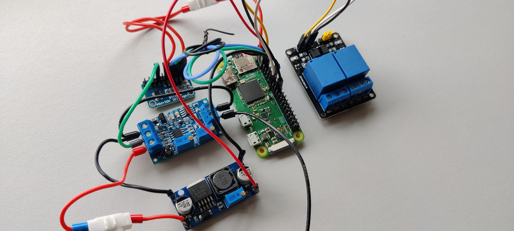
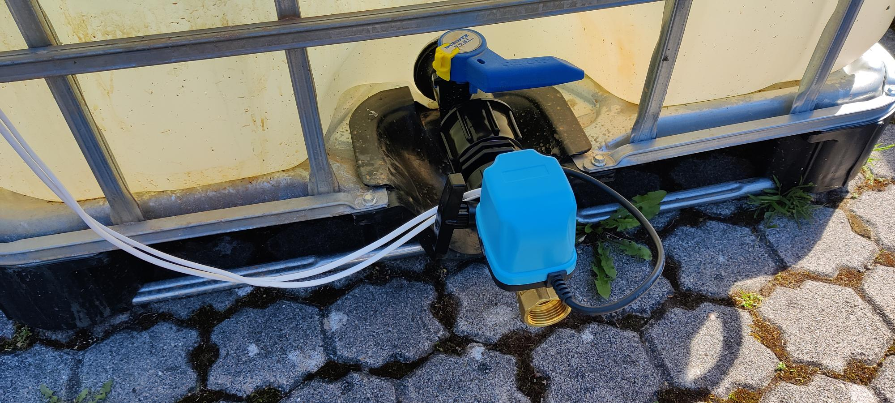

# OOWV Smart Watertank Controller

Willkommen in der Dokumentation für das OOWV Smart Watertank Controller Repository. Hier erfährst du alles, was du über den Controller zur Steuerung des intelligenten Wassertanks wissen musst.

## Hardware
#### Controller

Folgende Hardware-Komponenten werden für den Controller benötigt:

- Raspberry Pi Zero W: Ein leistungsstarker Einplatinencomputer.  
https://www.amazon.de/dp/B06XFZC3BX

- SanDisk Ultra Android microSDHC 32GB: Zum Speichern des Betriebssystems und der Daten.  
https://www.amazon.de/dp/B08GY9NYRM

- AZDelivery 2-Relais Modul 5V: Für die Schaltung von Geräten.  
https://www.amazon.de/dp/B078Q326KT

- Aufwärtswandler XL6009(3V-32V zu 5V-35V): Zur Spannungsanpassung.  
https://www.amazon.de/dp/B00HV59922

- Füllstandssensor (TL-136): Misst den Wasserstand im Tank.  
https://www.amazon.de/dp/B08YWQJM1T

- Analog-zu-Digital-Wandlermodul ADS1115: Konvertiert analoge Signale in digitale Werte.  
https://www.amazon.de/dp/B09135KBLT

- Strom zu Spannungsmodul (4-20Ma Bis 0-3.3V 5V 10V): Wandelt Strom in Spannungsbereich um.  
https://www.amazon.de/dp/B07TWLG37N

- Micro USB Netzteil (Raspberry Pi 5V 3A Netzteil)

- Micro-USB Kabel  

- Verteilerdose zum Verstauen der Hardware-Komponenten  

#### Wassertank

- 1000L IBC Container  
https://www.rekubik.de/ibc-container/neue-ibc/1000l-ibc-container-rebottled-food-auf-stahlpalette-neuwertig?number=RK50122

- IBC Adapter S60x6 - 2-fach 1" Kugelhahn mit 3/4" Tülle  
https://www.rekubik.de/ibc-zubehoer/adapter/s60x6-grobgewinde/ibc-adapter-s60x6-2-fach-1-kugelhahn-mit-3/4-tuelle-geka-kompatibel

- Motorkugelhahnventil  
https://www.amazon.de/dp/B07V2VX76C

## Installation

#### Installation des Raspberry Pi Zero

Um das Raspberry Pi OS auf dem Raspberry zu installieren empfiehlt sich der [Raspberry Pi Imager](https://www.raspberrypi.com/software/).

Als Betriebssystem sollte das Raspberry Pi OS (32-bit) ausgewählt werden und als Speichermedium die jeweilige mit dem PC verbundene SD-Karte.
Unter den Erweiterten Optionen müssen anschließend ein Hostname gesetzt werden sowie die SSH Option aktiviert werden und dafür Benutzername und Passwort für die Anmeldung des SSH Clients erstellt und notiert werden.
Abschließend müssen zur Verbindung mit einem Netzwerk noch die benötigten Daten eingetragen werden.


Anschließend kann die Installation gestartet werden.

<br>

#### Zugriff auf den Raspberry Pi mittels SSH Terminal
Nach Abschluss der Installation des OS auf der SD Karte, kann diese anschließend in den Kartenslot des Raspberry gesteckt und der Raspberry mittels USB mit einem Computer oder einer anderen 5V Stromquelle verbunden werden.
Nachdem der Raspberry erfolgreich hochgefahren ist, kann auf den Pi mittels SSH Verbindung zugegriffen werden.


#### Powershell
```
ssh <benutzername>@<raspberrypi-netzwerk-ip>
<benutzername>@<raspberrypi-netzwerk-ip>'s password:<passwort>
```

#### Termius
Um mit dem Raspberry PI zu kommunizieren kann ein Service wie Termius verwendet werden. Dieser bietet eine SHH- sowie eine SFTP-Funktion um Dateien einfach auf den Raspberry Pi zu laden.

#### Ändern des Netzwerks
Falls sich nach der Installation das Netzwerk ändert, muss die SD Karte aus dem Pi entfernt und mit dem Computer verbunden werden. Im dortigen Verzeichnis muss anschließend eine Datei namens ***wpa_supplicant.conf*** mit folgendem Inhalt hinterlegt werden:

```
ctrl_interface=DIR=/var/run/wpa_supplicant GROUP=netdev
update_config=1
country=DE
network={
   ssid="WLAN-SSID"
   psk="WLAN-PASSWORT"
}
```
Anschließend kann der Pi mit eingelegter SD-Karte neugestartet werden.

<br>

#### Installation der notwendigen Bibliotheken

Mit den folgenden Befehlen werden die bereits auf dem Gerät installierten möglicherweise veralteten Pakete aktualisiert.
```
sudo apt update
sudo apt full-upgrade
```
Da der Analog-zu-Digitalwandler über den seriellen Kommunikationsbus I2C mit dem Raspberry kommuniziert,
muss dieser auf dem Pi noch eingeschaltet werden.
```
sudo raspi-config
```
Im Konfigurationsmenü navigiere zu "Interfacing Options" (Schnittstellenoptionen) und wähle "I2C".
Bestätige die Aktivierung des I2C-Interfaces.
Starte deinen Raspberry Pi neu, damit die Änderungen wirksam werden:
```
sudo reboot
```

<br>

#### Installation des Quellcodes auf dem Raspberry Pi Zero

Bevor der Quellcode auf dem Raspberry Pi installiert werden kann, muss zunächst im Benutzerverzeichnis 
*/home/user* (user steht für den gewählten Benutzernamen) eine virtuelle Umgebung erstellt werden.
```
python3 -m venv venv
```

Anschließend kann der Quellcode mittels Git auf den Raspberry Pi in das *home/user/venv* Verzeichnis 
geladen werden oder alternativ auch im Browser als Archiv heruntergeladen und mittels STFTP Client auf den 
Raspberry Pi geladen werden.

```
git clone https://github.com/OOWVxQF/Smartwatertank-Controller.git
```
Anschließend muss zuerst im venv Verzeichnis die Virtuelle Umgebung aktiviert werden.
Die aktivierte Umgebung ist in der Konsole durch das Prefix *(venv)* vor dem Pfad zu erkennen.
```
source bin/activate
```

Anschließend müssen im Verzeichnis venv/Smartwatertank-Controller die in der *requirements.txt* Datei aufgelisteten
Bibliotheken installiert werden.
```
pip install -r requirements.txt
```

<br>

#### Speicheraddresse des ADS1115 Moduls
Damit der Analog-zu-Digitalwandler über den I2C Bus angesprochen werden kann, muss die Speicheraddresse des Moduls bekannt sein.
Diese kann mittels folgendem Befehl ausgelesen werden:
```
sudo i2cdetect -y 1
```
Sollte die dort ausgegebene Adresse nicht 0x49 sein sondern zB. 0x48, muss diese in der Datei *hardware.py* in Zeile 31 durch die richtige Adresse ersetzt werden. Falls in der Ausgabe keine Addresse angezeigt wird, muss das Modul nochmal überprüft werden.

<br>

#### Testen des Programms
Um das Programm auch für den Zusammenbau der Hardware zu testen und die Konsolenausgaben direkt zu sehen, 
kann es im Verzeichnis *venv/Smartwatertank-Contoller* wie folgt ausgeführt werden:
```
python oowvcontroller.py
```

<br>

#### Installation des Services
Damit die Controller-Software automatisch ausgeführt wird sobald der Controller gestartet wird, muss ein Linux Service eingerichtet werden.

Zunächst muss der im Raspberry Pi Setup eingetragene Benutzername noch in beiden Verzeichnispfaden der *oowv-controller.service* Datei eingetragen werden.

```
ExecStart=/home/<ersetzen>/venv/bin/python /home/<ersetzen>/venv/Smartwatertank-Controller/oowvcontroller.py
```

Anschließend kann die Datei aus dem Verzeichnis *venv/Smartwatertank-Controller* in das Verzeichnis */etc/systemd/system* verschoben werden.
```
sudo mv oowv-controller.service /etc/systemd/system
```
Mit folgenden Befehlen kann der Service anschließend gesteuert werden:
```
sudo systemctl enable oowv-controller.service //Aktiviert den Service
sudo systemctl start oowv-controller.service //Startet den Service
sudo systemctl status oowv-controller.service //Gibt den Status des Service aus
sudo systemctl restart oowv-controller.service //Startet den Service neu
sudo system ctl stop oowv-controller.service //Stoppt den Service
```
```
sudo journalctl -f -u oowv-controller.service //Gibt die Logausgabe des Services aus
```
Anschließend kann der Controller mit der App verwendet werden.

<br>

### Aufbau der Hardware

Für die Konstruktion des Controllers werden neben den Komponenten noch weiteres Werkzeug und Bauteile benötigt:
- Lötkolben und Lötzinn
- Kabel und Lüsterklemmen
- Aderendhülsen und Crimpzange
- Multimeter

#### Controller

Zu Beginn empfiehlt es sich die Komponenten lose in der Dose anzuordnen und anschließend zB. mit einer Heißklebe Pistole zu befestigen.
Alternativ können die Komponenten auch auf einem Perfboard verlötet und dieses anschließend in der Dose befestigt werden.
Einige Komponenten müssen bevor Kabel an die Pins angeschlossen werden können noch mit der jeweils mitgelieferten Stifleiste verlötet werden.
Anschließend können die Öffnungskappen der Dose für den Stecker des Netzteils sowie Kabel des Ventils und Wassersensors entfernt und die Kabel bzw. Stecker in den Öffnungen befestigt werden.

Danach können die Kompononenten nach dem Schaltplan miteinander verkabelt werden.


Schaltplan mit Stromversorgung über Netzteil


Die verkabelten Komponenten.


Die verkabelten Komponenten in der Verteilerdose


Der vollständige Controller mit Sensor und Ventil

#### Stromversorgung
Wie im Schaltplan zu sehen, wird der Raspbery Pi über ein Micro USB Kabel mit Strom versorgt. 
Dieses Kabel kann für die Entwicklung zwar an einen Laptop angeschlossen werden, 
sobald der Controller allerdings im Freien steht, sollte der Pi entweder über ein Batteriepack 
oder ein 5V/3A Netzteil mit Strom versorgt werden.

#### Aufwärtswandler
Um das Ventil sowie den Sensor mit 24V zu versorgen muss der Aufwärtswandler auf 5V Eingangsspannung und 24V Ausgangsspannung eingestellt werden.
Dies geschieht durch Drehen des kleinen Rädchens auf dem Modul.
Zur Überprüfung des Spannungsverhältnisses misst man mittels Multimeter den Spannungsabfall zwischen Eingangs- und Ausgangsspannung.

#### Strom-zu-Spannungswandler
Mittels des Spannungswandlers wird der Strom des Wassersensors in eine Spannung umgewandelt. Desweiteren kann über den Wandler ein Spannungsmaximum für den gefüllten Tank und ein Spannungsminimum für den leeren Tank eingestellt werden.
Beim Spannungswandler geschieht dies ebenfalls über die Drehrädchen auf dem Modul. Während sich das Spannungsminimum sehr leicht simulieren lässt indem der Wassersensor nicht eingetaucht ist und somit über das ZERO Rädchen auf ein Spannungsminimum von 0V eingestellt werden kann, muss für das Spannungsmaximum der Wassersensor 1 Meter tief in Wasser eingetaucht werden. Dafür legt man den Wassersensor in ein Kunststoffrohr (HT-Rohr) und befüllt dieses auf 1 Meter mit Wasser. Anschließend kann über das SPAN Rädchen das Spannungsmaximum auf 3,3V eingestellt werden. 
Zur Überprüfung der Spannungen empfiehlt sich hier die Verwendung eines Multimeters indem man den Spannungsabfall auf dem Spannungswandler zwischen GND und VOUT misst.


#### Wassertank

Nach dem Zusammenbau des Controllers kann dieser am eigentlichen Wassertank installiert werden. Dabei sollte darauf geachtet werden, dass der Controller sowie das Netzteil vor Regen geschützt und die Kabelverbindungen gut isoliert sind.


Das Motor-Ventil am Wassertank.


Der Wassertank mit Motor-Ventil und Controller

## Acknowledgements

* [The Raspberry Pi Platform](https://www.raspberrypi.com)